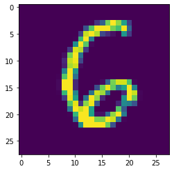
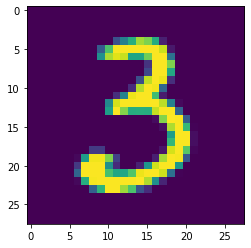

```python
#!/usr/bin/env python3
# -*- coding: utf-8 -*-
"""
Created on Thu Jun 20 15:47:23 2019

Credit:
    https://github.com/paraschopra/bayesian-neural-network-mnist

@author: Ali Shannon
"""

#%% Libraries to use

import torch
from torch import nn
from torch.utils.data import DataLoader
import torch.nn.functional as F
import numpy as np
from torchvision import datasets, transforms
from matplotlib import pyplot as plt
from matplotlib import colors

import pyro # pip install pyro-ppl
from pyro import optim
from pyro.infer import SVI, Trace_ELBO
import pyro.distributions as dist

device = 'cuda' if torch.cuda.is_available() else 'cpu'
```

This is our pytorch network that we will "lift" into a pyro module


```python
class NN(nn.Module):
    def __init__(self, in_shape, hidden_shape, out_shape):
        super(NN, self).__init__()
        
        self.fc1 = nn.Linear(in_shape, hidden_shape)
        self.out = nn.Linear(hidden_shape, out_shape)
        
    def forward(self, x):
        x = x.flatten(1)
        x = F.relu(self.fc1(x))
        return self.out(x)
        
    
train_loader = DataLoader(
        datasets.MNIST('emnist', train=True, download=True,
                       transform=transforms.ToTensor()),
                batch_size=128, shuffle=True, num_workers=4)
        
test_loader = DataLoader( 
        datasets.MNIST('emnist', train=False,
                       transform=transforms.ToTensor()),
                batch_size=128, shuffle=True, num_workers=4)
        
# this will be our neural network
net = NN(28*28, 1024, 10).to(device)
```

Here we will defined the converter to random variables `pyro.random_module` where the output of our network are random variables


```python
def model(x, y):
    priors = {}
    for name, param in net.named_parameters():
        priors[name] = dist.Normal(loc=torch.zeros_like(param.data), 
                                        scale=torch.ones_like(param.data))
        
    lifted_module = pyro.random_module("module", net, priors)
    lifted_clf_model = lifted_module()
    lhat = F.log_softmax(lifted_clf_model(x), 1)
    pyro.sample("obs", dist.Categorical(logits=lhat), obs=y)
```

This is how the Bayesian network works, it uses this form of Bayes Theorem

```math
P(A|B) = \frac{P(B|A)\; P(A)}{P(B)}
```

Where:

```math
P(B) = \sum_{i} P(B|A_{i})\; P(A_{i})
```

But this sum is very hard to compute because there will be too many parameters. So instead we will draw random samples and report the posterior mean as our point estimate and posterior uncertainty as our error. This is at the heart of Stochastic Variational Inference (SVI): https://www.youtube.com/watch?v=DYRK0-_K2UU

Roughly, this method assumes that the prior is always some normal distribution and updates the point estimates through the network.


```python
def guide(x, y):
    priors = {}
    for name, param in net.named_parameters():
        mu = torch.randn_like(param)
        sigma = torch.randn_like(param)
        mu_param = pyro.param(name+'.mu', mu)
        sigma_param = F.softplus(pyro.param(name+'.sigma', sigma))
        prior = dist.Normal(loc=mu_param, scale=sigma_param)
        priors[name] = prior
        
    lifted_module = pyro.random_module('module', net, priors)
    return lifted_module()
```

Set up optimizer and loss function


```python
opt = optim.Adam({'lr': 0.01})
svi = SVI(model, guide, opt, loss=Trace_ELBO())
```

Train Model


```python
def train():
    pyro.clear_param_store()
    epochs = 10
    loss = 0
    for epoch in range(1, epochs + 1):
        loss = 0
        for x, y in train_loader:
            loss += svi.step(x.flatten(1).to(device), y.to(device))
        total_loss = loss / len(train_loader.dataset)
        print(f'epoch: {epoch}\tLoss: {total_loss:.4g}')
        
train()
    
```

    epoch: 1	Loss: 2073
    epoch: 2	Loss: 363.2
    epoch: 3	Loss: 155.8
    epoch: 4	Loss: 110.5
    epoch: 5	Loss: 95.18
    epoch: 6	Loss: 89.92
    epoch: 7	Loss: 87.03
    epoch: 8	Loss: 86.42
    epoch: 9	Loss: 85.71
    epoch: 10	Loss: 85.49


There are two ways to evaluate this network.

- The first is to force it to predict even if it's unsure, which is what traditional neural networks do
- The second is to make the network say 'I don't know.' Which is what we want. This works by drawing samples and checking if they agree on the result.

Let's try the first one:


```python
num_samples = 10
def predict(x):
    sampled_models = [guide(None, None) for _ in range(num_samples)]
    yhats = [model(x.to(device)).data for model in sampled_models]
    mean = torch.mean(torch.stack(yhats), 0)
    return np.argmax(mean.cpu().numpy(), axis=1)

print('Prediction when network is forced to predict')
correct = 0
total = 0
for x, y in test_loader:
    predicted = predict(x.flatten(1))
    total += y.size(0)
    correct += (predicted == y.numpy()).sum().item()
print(f'Accuracy: {correct/total:.2%}')
```

    Prediction when network is forced to predict
    Accuracy: 88.69%


Now we let the network decide whether or not to predict 


```python
classes = [str(i) for i in range(10)]

num_samples = 100
def give_uncertainities(x):
    sampled_models = [guide(None, None) for _ in range(num_samples)]
    yhats = [F.log_softmax(model(x.flatten(1).to(device)).data, 1).cpu().detach().numpy() for model in sampled_models]
    return np.asarray(yhats)
    #mean = torch.mean(torch.stack(yhats), 0)
    #return np.argmax(mean, axis=1)


def test_batch(images, labels, plot=True):
    y = give_uncertainities(images)
    predicted_for_images = 0
    correct_predictions=0

    for i in range(len(labels)):
        if(plot):
            print("Real: ",labels[i].item())
            fig, axs = plt.subplots(1, 10, sharey=True,figsize=(20,2))
    
        all_digits_prob = []
        highted_something = False
        for j in range(len(classes)):
        
            highlight=False
            histo = []
            histo_exp = []
            for z in range(y.shape[0]):
                histo.append(y[z][i][j])
                histo_exp.append(np.exp(y[z][i][j]))
            
            prob = np.percentile(histo_exp, 50) #sampling median probability
        
            if(prob>0.2): #select if network thinks this sample is 20% chance of this being a label
                highlight = True #possibly an answer
        
            all_digits_prob.append(prob)
            
            if(plot):
            
                N, bins, patches = axs[j].hist(histo, bins=8, color = "lightgray", lw=0,  weights=np.ones(len(histo)) / len(histo), density=False)
                axs[j].set_title(str(j)+" ("+str(round(prob,2))+")") 
        
            if(highlight):
            
                highted_something = True
                
                if(plot):

                    # We'll color code by height, but you could use any scalar
                    fracs = N / N.max()

                    # we need to normalize the data to 0..1 for the full range of the colormap
                    norm = colors.Normalize(fracs.min(), fracs.max())

                    # Now, we'll loop through our objects and set the color of each accordingly
                    for thisfrac, thispatch in zip(fracs, patches):
                        color = plt.cm.viridis(norm(thisfrac))
                        thispatch.set_facecolor(color)

    
        if(plot):
            plt.show()
    
        predicted = np.argmax(all_digits_prob)
    
        if(highted_something):
            predicted_for_images+=1
            if(labels[i].item()==predicted):
                if(plot):
                    print("Correct\n")
                correct_predictions +=1.0
            else:
                if(plot):
                    print("Incorrect :()\n")
        else:
            if(plot):
                print("Undecided.\n")
        
        if(plot):
            plt.imshow(images[i].squeeze())
        
    
    if(plot):
        print("Summary")
        print("Total images: ",len(labels))
        print("Predicted for: ",predicted_for_images)
        print("Accuracy when predicted: ",correct_predictions/predicted_for_images)
        
    return len(labels), correct_predictions, predicted_for_images


#%% Prediction when network can decide not to predict

print('Prediction when network can refuse')
correct = 0
total = 0
total_predicted_for = 0
for j, data in enumerate(test_loader):
    images, labels = data
    
    total_minibatch, correct_minibatch, predictions_minibatch = test_batch(images, labels, plot=False)
    total += total_minibatch
    correct += correct_minibatch
    total_predicted_for += predictions_minibatch

print("Total images: ", total)
print("Skipped: ", total-total_predicted_for)
print(f"Accuracy when made predictions: {correct/total_predicted_for:.2%}")
```

    Prediction when network can refuse
    Total images:  10000
    Skipped:  1101
    Accuracy when made predictions: 95.03%


Print out samples of distributions for each digit


```python
test_batch(images[:10], labels[:10])
```

    Real:  6


    Correct
    
    Real:  6


    Correct
    
    Real:  0





    Correct
    
    Real:  9


    Incorrect :()
    
    Real:  8


    Undecided.
    
    Real:  4


    Correct
    
    Real:  3


    Incorrect :()
    
    Real:  3


    Correct
    
    Real:  3





    Incorrect :()
    
    Real:  8


    Correct
    
    Summary
    Total images:  10
    Predicted for:  9
    Accuracy when predicted:  0.6666666666666666


    (10, 6.0, 9)


```python

```
